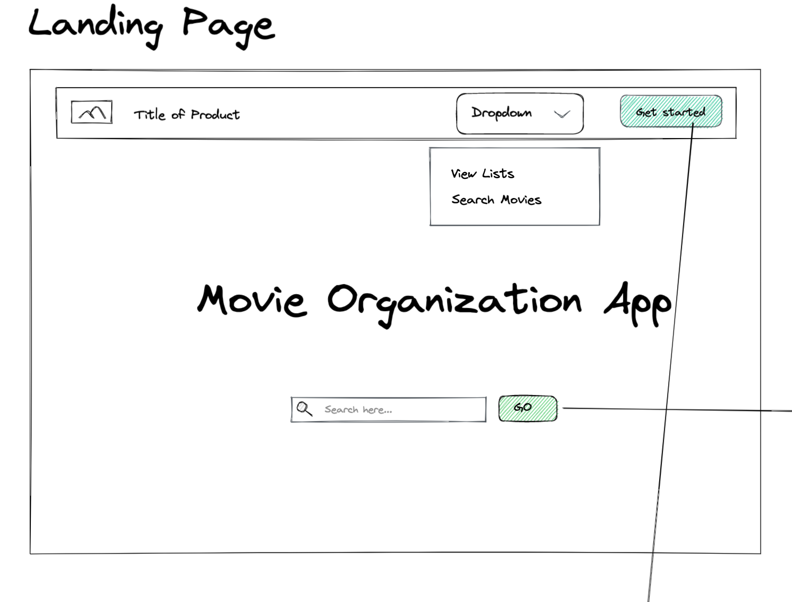
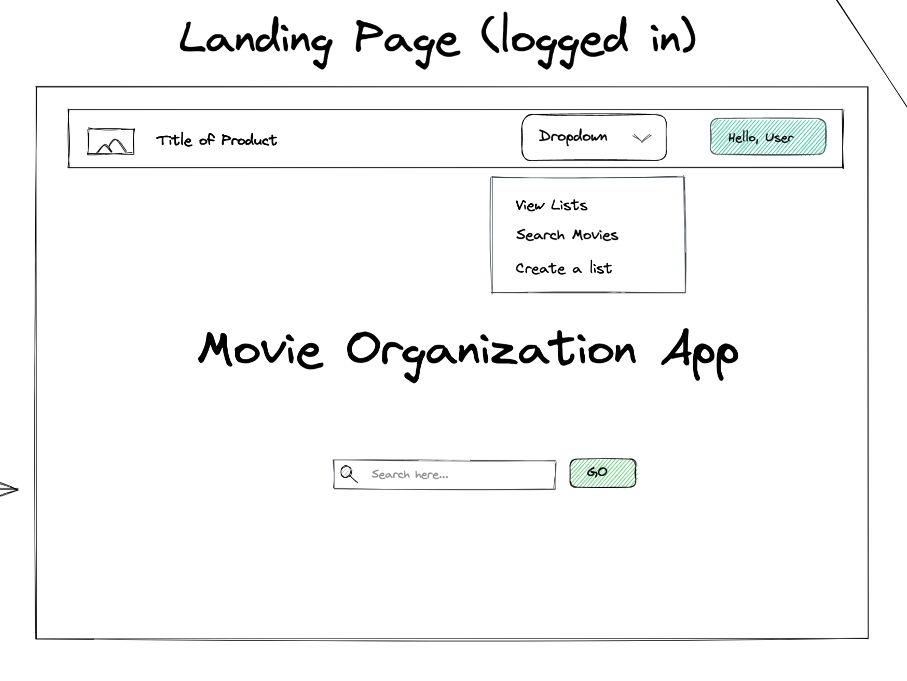
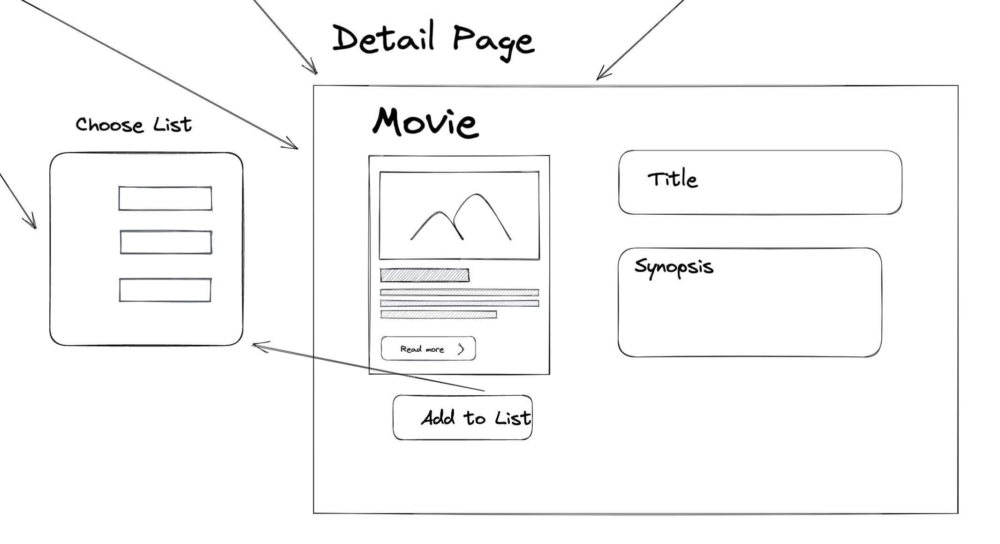
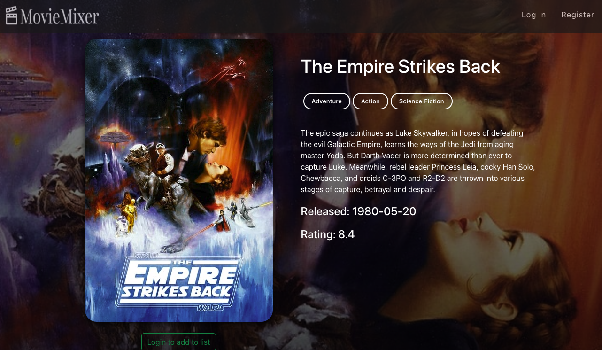

# Graphical Human Interface

---

## Landing Page (logged out)

### This will be the first page the user will see upon arrival to the page. The user must be logged in to see all features.

## Landing Page(logged in)

### This is what the user will see upon login.

## Login/Signup Form Page

### Here, the user will be able to either login or signup for our site.

## My List View

### As the use builds their list, this page will fill with the movies that they have added to it.

Here is the List of your lists:

And Here is the detail of one list:

## List View for All Lists

### On this page, you will be able to view all of the other lists the user has created.

## Detail Page

### This is where the user will be able to view the detials of the selected movie.

## Search Page

### This is where the user will search for the movie they wish to add to their list.

## Movie Trivia

This was originally a stretch goal, however we decided to include it in the mvp!

